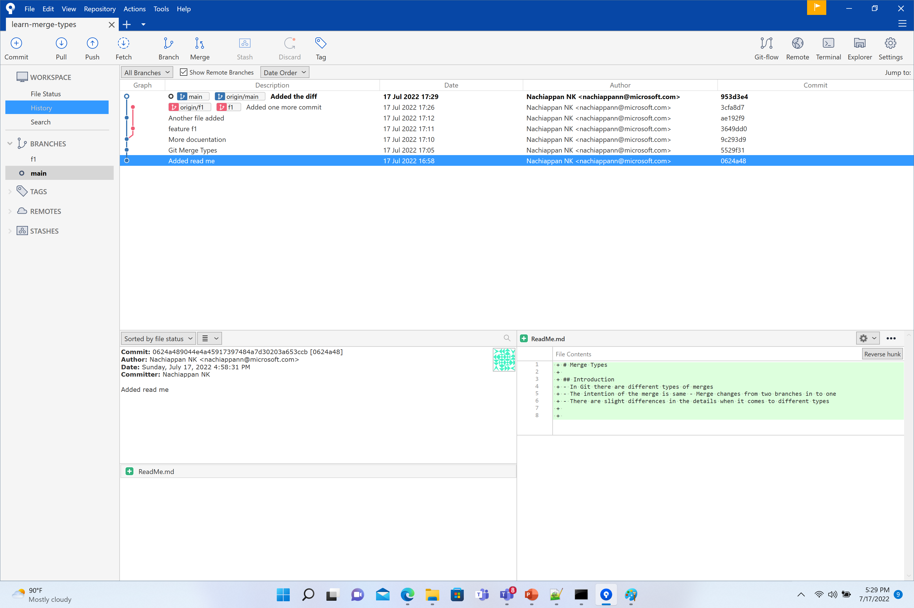
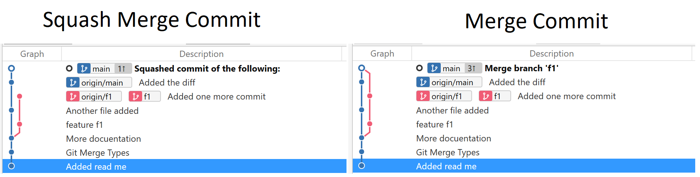
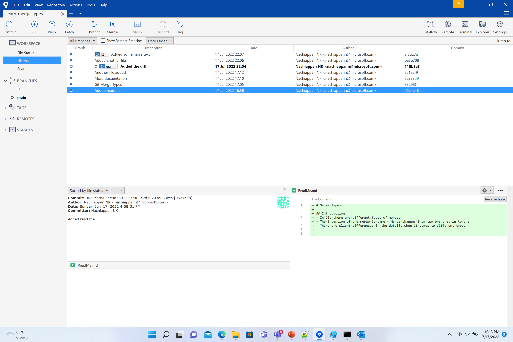
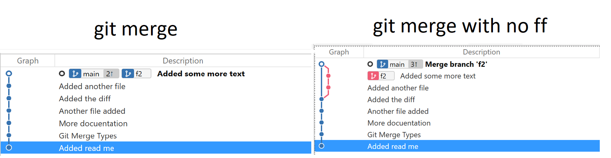

# Merge Types

## Introduction
- In Git there are different types of merges
- The intention of the merge is same - Merge changes from two branches in to one
- There are slight differences in the details when it comes to different types
- When a branch b1 is merged in to branch b2, there is a new commit in branch b2. This commit can be either `merge commit` or `squash merge commit`
- The below image depicts the need to merge. The code in branch `f1` needs to be merged to `main`

## Merge Commit vs Sqash Merge Commit

### Merge Commit
- A new commit with 2 ancestors are added

### Squash Merge Commit
- A new commit with the branch squash is added. There is only one ancestor

## Fastforward option
- When the branch that is getting merged contains all the commits of the branch that it is getting merged in to, merge defaults to fast forward
- Fastforward has to be explicitly disabled

## With Fastforward disabled and enabled

### With Fastforward disabled
- A merge commit is created
- Useful to run post commit hooks

### With Fastforward option
- No new commit is created.
- The branch pointer is changed to point to the new branch
- With this merge, post merge hooks with not be run

## Comparison
| Merge  | Merge with no fastforward  | Merge with squash |
| ------------- | ------------- | ------------- |
| The main branch must be checked out  | The main branch must be checked out  | The main branch must be checked out  |
| git merge feature-branch-name  | git merge --no-ff feature-branch-name  | git merge --squash feature-branch-name & git commit --no-edit  |
| Fast forward Merge will happen if possible |  Fast forward Merge not happen even if possible | Fast forward Merge not happen even if possible | 
| If FF is not possible, merge commit will be added | merge commit will be added | The branch will be squashed and no commit will be added. It must be added by the second command |
| Linear version history is not possible | Linear version history is not possible | Version history will be linear |
| Commit hooks might not run | Commit hooks will run | Commit hooks will run |
 

